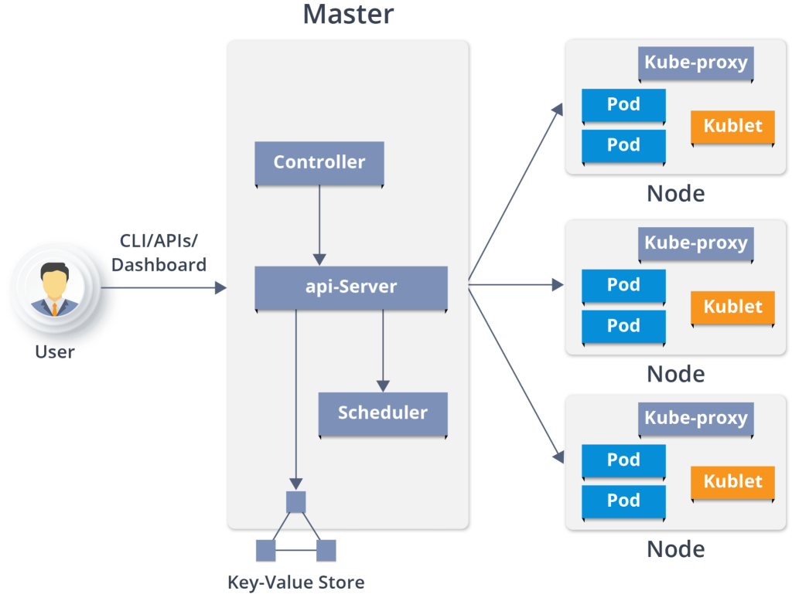
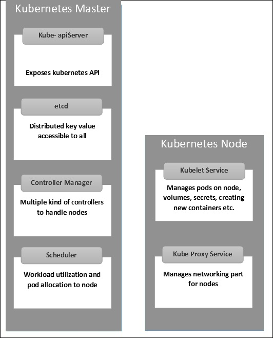

# I. K8s - Architecture

K8s có kiến trúc Client-Server bao gồm các node master và worker.

## 1. Master node

- **Master node** (hay node chính) là nơi đảm nhiệm tất cả các tác vụ quản trị chịu trách nhiệm quản lý cụm Kubernetes. Có thể có nhiều hơn một node chính trong cụm để tăng khả năng chịu lỗi

### 1.1 API Server 
Cung cấp các API dưới dạng REST để tương tác với tất cả các thành phần trong cluster như là pod, service, etc. 

### 1.2 ETCD cluster
Là nơi lưu trữ các thông tin, trạng thái của các cluster dưới dạng ky-value.

### 1.3 Controller Manager
chạy các controllers. Chúng là các background threads chạy các task bên trong cluster. Controller bao gồm nhiều vai trò khác nhau, nhưng tất cả được compiled thành một single binary. Những vai trò của controllers bao gồm:

- **Node controller** chịu trách nhiệm cho trạng thái của worker(worker state)

- **Replication controller** chịu trách nhiệm cho việc đảm bảo duy trì (maintaining) đúng số lượng của Pods

- **End-point Controller** kết nối services và Pods với nhau.

- **Service account** và **token controllers** quản lý access management.

### 1.4 Scheduler
Có trách nhiệm phân chia tải. Nó sẽ theo dõi tài nguyên đang được sử dụng trong cluster và phân chia workload vào các resource đang sẵn sàng. 

## 2. Worker node
### 2.1 Kubelet
Là thành phần được cài ở mỗi worker node có trách nhiệm lắng nghe những yêu cầu từ kube-API server như là tạo mới hoặc là phá hủy các container. Kube-api server sẽ nhận được các report định kì từ kubelet và dùng nó để theo dõi trạng thái của node và các container bên trong chúng.

### 2.2 kube-proxy
Giúp chuyển tiếp request đến đúng container đang rảnh.

